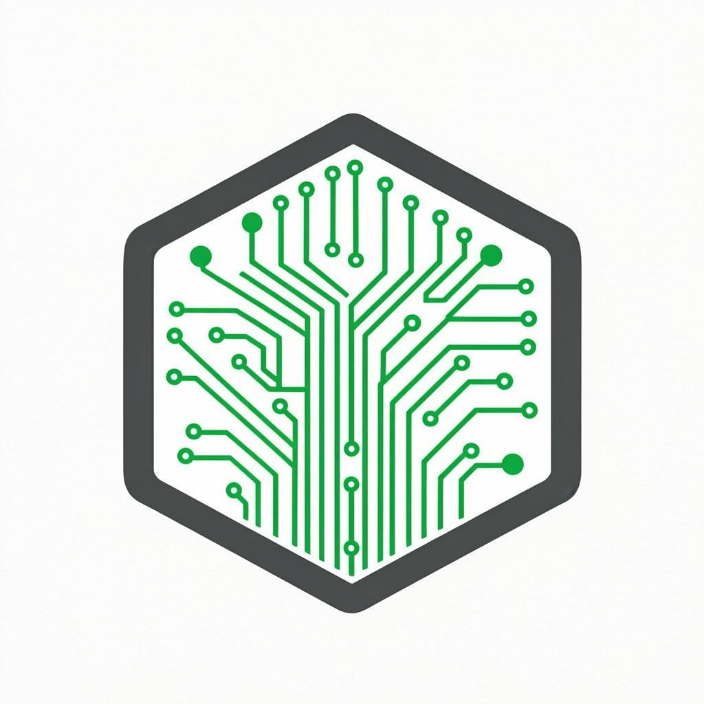
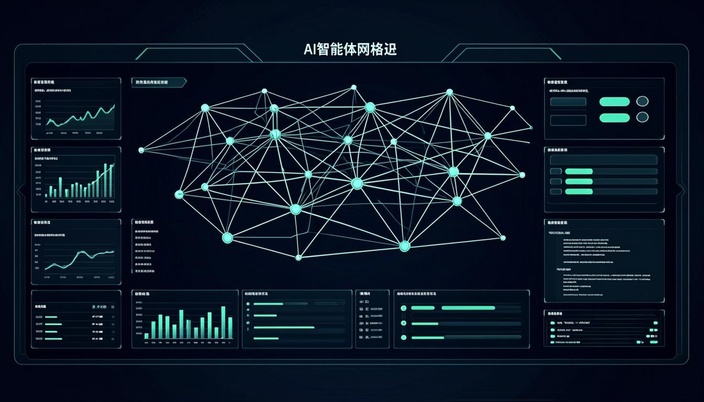

<p align="center">
  
</p>

<h1 align="center">OpenHarness — Agent System</h1>

<p align="center">
  <strong>Open Agent Harness</strong> — 可视化 AI 智能体管理与协作平台
</p>

<p align="center">
  
  
  
  
  
  
</p>

<p align="center">
  
</p>

---

## 📖 项目简介

**OpenHarness Agent System** 是一个基于 [OpenHarness](https://github.com/HKUDS/OpenHarness) 框架核心理念构建的 **全功能 AI 智能体可视化管理系统**。它实现了 OpenHarness 的五大核心子系统 —— Agent Loop（智能体循环）、Tool-Use（工具调用）、Skills（按需知识）、Memory（持久记忆）和 Governance（安全治理），并提供直观的 Web 界面进行管理和交互。

### 🎯 核心理念

OpenHarness 认为：**Agent Harness = LLM + Tools + Knowledge + Observation + Action + Permissions**

- **模型提供智能**，Harness 提供双手、眼睛、记忆和安全边界
- 一切围绕 **Agent Loop** 展开：用户输入 → 流式响应 → 工具检测 → 权限检查 → 执行工具 → 循环
- 工具、技能、记忆都是 **可插拔的模块**

---

## ✨ 功能特性

### 📊 Dashboard（系统仪表盘）
- 实时统计数据（活跃 Agent 数、可用工具数、运行任务数、记忆条目数）
- 架构概览可视化（五大子系统卡片）
- Agent Loop 执行流程图
- 实时活动流（最近消息、工具调用、事件）
- Agent 列表及状态概览
- 任务分布可视化

### 🤖 Agent Playground（智能体工作台）
- **真实 AI 对话** — 接入 LLM API，支持多轮对话
- 多 Agent 切换（Alpha-代码助手、Beta-研究助手、Gamma-运维助手）
- 会话管理（新建、切换、自动标题）
- 工具调用可视化卡片
- Agent Loop 状态实时显示（空闲/思考中/执行工具）
- Token 用量实时统计

### 🔧 Tool Registry（工具注册表）
- 展示所有可用工具（按分类组织）
- 工具搜索和分类筛选
- 权限模式切换（Default/Restricted/Sandboxed）
- 工具启用/禁用开关
- 工具详情展开（参数列表、JSON Schema）

### 📚 Skills Manager（技能管理器）
- 技能按类别展示（开发/文档/研究/通信）
- 技能加载/卸载切换
- 技能详情面板（工作流程、使用场景）
- 搜索和分类筛选

### 🤝 Swarm Coordination（群体协调）
- 多 Agent 团队管理
- 网络拓扑可视化（Coordinator ↔ Workers）
- 团队成员状态监控
- 任务完成度统计

### 🧠 Memory System（记忆系统）
- 持久记忆条目管理
- 会话上下文（CLAUDE.md）展示
- 对话历史记录
- 上下文利用率统计

### 🛡️ Permissions（安全治理）
- 三种权限模式（Default/Auto/Plan）
- 路径规则管理（允许/拒绝/询问）
- 命令黑名单
- Hook 管理（PreToolUse/PostToolUse）

### 📋 Task Manager（任务管理器）
- 后台任务追踪与创建
- 任务过滤（全部/运行中/已完成/失败/排队）
- 优先级管理（高/中/低）
- 进度条可视化
- 任务详情和操作（停止/重试）

---

## 🏗️ 系统架构

```
src/
├── app/
│   ├── layout.tsx              # 根布局 + ThemeProvider
│   ├── page.tsx                # 主页面（Sidebar + 路由）
│   ├── globals.css             # 全局样式 + 主题变量
│   └── api/
│       ├── agent/chat/         # AI 对话 API（接入 z-ai-web-dev-sdk）
│       ├── agents/             # Agent CRUD
│       ├── conversations/      # 会话 CRUD
│       ├── tools/              # 工具 CRUD
│       ├── skills/             # 技能 CRUD
│       ├── tasks/              # 任务 CRUD
│       ├── stats/              # 统计数据
│       └── seed/               # 数据库初始化
├── components/
│   ├── pages/
│   │   ├── DashboardPage.tsx   # 系统仪表盘
│   │   ├── PlaygroundPage.tsx  # Agent 工作台
│   │   ├── ToolsPage.tsx       # 工具注册表
│   │   ├── SkillsPage.tsx      # 技能管理器
│   │   ├── SwarmPage.tsx       # 群体协调
│   │   ├── MemoryPage.tsx      # 记忆系统
│   │   ├── PermissionsPage.tsx # 安全治理
│   │   └── TasksPage.tsx       # 任务管理器
│   └── ui/                     # shadcn/ui 组件库
├── stores/
│   └── agent-store.ts          # Zustand 全局状态管理
├── lib/
│   ├── db.ts                   # Prisma 数据库客户端
│   └── utils.ts                # 工具函数
└── prisma/
    └── schema.prisma           # 数据库 Schema（10 个模型）
```

### 数据模型

| 模型 | 说明 | 关键字段 |
|------|------|----------|
| **Agent** | AI 智能体定义 | name, type, systemPrompt, provider, model, status |
| **Tool** | 可用工具 | name, category, inputSchema, permissionMode, isEnabled |
| **Skill** | 知识模块 | name, content, category, isLoaded |
| **Conversation** | 对话会话 | title, agentId, status |
| **Message** | 聊天消息 | role, content, toolCalls, toolResults, tokenCount |
| **AgentTeam** | Agent 团队 | name, description, config |
| **TeamMember** | 团队成员 | teamId, agentId, role |
| **Task** | 后台任务 | title, status, priority, progress, result |
| **Memory** | 持久记忆 | agentId, key, value, category |
| **PermissionRule** | 权限规则 | mode, pathPattern, isAllowed, commandDenyList |

### API 端点

| 端点 | 方法 | 说明 |
|------|------|------|
| `/api/agent/chat` | POST | AI 对话（接入 LLM） |
| `/api/agents` | GET/POST | Agent 列表/创建 |
| `/api/agents/[id]` | GET/PUT/DELETE | Agent 详情/更新/删除 |
| `/api/conversations` | GET/POST | 会话列表/创建 |
| `/api/tools` | GET/POST/PUT | 工具列表/创建/切换 |
| `/api/skills` | GET/POST/PUT | 技能列表/创建/切换 |
| `/api/tasks` | GET/POST | 任务列表/创建 |
| `/api/tasks/[id]` | GET/PUT/DELETE | 任务详情/更新/删除 |
| `/api/stats` | GET | 仪表盘统计 |
| `/api/seed` | POST | 数据库初始化 |

---

## 🚀 快速开始

### 环境要求

- **Node.js** ≥ 18
- **Bun**（包管理器）
- **Git**

### 安装与运行

```bash
# 1. 克隆仓库
git clone https://github.com/dav-niu474/OpenHarness.git
cd OpenHarness

# 2. 安装依赖
bun install

# 3. 初始化数据库
bun run db:push

# 4. 启动开发服务器
bun run dev

# 5. 初始化种子数据
curl -X POST http://localhost:3000/api/seed
```

访问 http://localhost:3000 即可使用系统。

### 技术栈

| 类别 | 技术 | 说明 |
|------|------|------|
| 框架 | Next.js 16 | App Router, Server Components |
| 语言 | TypeScript 5 | 严格模式 |
| 样式 | Tailwind CSS 4 | 原子化 CSS |
| UI 组件 | shadcn/ui | 50+ 组件 |
| 数据库 | Prisma ORM | SQLite |
| 状态管理 | Zustand | 轻量级客户端状态 |
| 动画 | Framer Motion | 流畅过渡动画 |
| AI SDK | z-ai-web-dev-sdk | LLM 对话能力 |

---

## 🗺️ 开发迭代计划

### Phase 1 ✅ — 核心框架（已完成）

- [x] 项目初始化（Next.js 16 + TypeScript + Tailwind CSS 4 + shadcn/ui）
- [x] 数据库设计（10 个 Prisma 模型）
- [x] 响应式布局系统（可折叠侧边栏 + 8 个页面路由）
- [x] Zustand 全局状态管理
- [x] 后端 API 框架（CRUD + 统计 + 种子数据）

### Phase 2 ✅ — 可视化仪表盘（已完成）

- [x] Dashboard 页面（实时统计、架构概览、活动流）
- [x] Agent Playground（真实 AI 对话、多 Agent 切换）
- [x] Tool Registry（工具展示、分类筛选、启用切换）
- [x] Skills Manager（技能展示、加载/卸载）

### Phase 3 ✅ — 管理功能（已完成）

- [x] Swarm Coordination（团队可视化、网络拓扑）
- [x] Memory System（持久记忆、会话上下文）
- [x] Permissions（权限模式、路径规则、命令黑名单）
- [x] Task Manager（任务 CRUD、进度追踪、优先级）

### Phase 4 🔲 — 增强 Agent 能力（计划中）

- [ ] **MCP 协议集成** — 接入 Model Context Protocol 服务器
- [ ] **流式响应** — SSE/WebSocket 实时流式对话
- [ ] **工具执行引擎** — 真正的文件读写、Shell 执行、代码搜索
- [ ] **多模态支持** — 图片理解、文件上传、语音输入
- [ ] **Agent 自定义** — 用户自定义 Agent（System Prompt、模型选择）

### Phase 5 🔲 — 多 Agent 协作（计划中）

- [ ] **子 Agent 派生** — 主 Agent 动态创建子 Agent 处理子任务
- [ ] **团队协作引擎** — Agent 间消息传递和任务委派
- [ ] **背景任务系统** — Agent 在后台自主执行长时间任务
- [ ] **任务队列管理** — 优先级队列、并发控制、超时重试
- [ ] **ClawTeam 集成** — 参考 ClawTeam 的群体智能模式

### Phase 6 🔲 — 高级安全与治理（计划中）

- [ ] **RBAC 权限系统** — 基于角色的访问控制
- [ ] **审计日志** — 完整的操作日志记录与查询
- [ ] **沙箱执行** — Agent 操作在隔离沙箱中执行
- [ ] **成本控制** — Token 用量限制和费用预算
- [ ] **内容过滤** — 输入输出内容安全审查

### Phase 7 🔲 — 插件生态（计划中）

- [ ] **插件系统** — 可扩展的命令、Hook、Agent 插件
- [ ] **自定义工具** — 用户定义新的工具类型
- [ ] **自定义技能** — 用户上传 .md 格式技能文件
- [ ] **Hook 系统** — PreToolUse/PostToolUse 事件钩子
- [ ] **兼容 anthropics/skills** — 直接复用 Claude 技能生态

### Phase 8 🔲 — 部署与运维（计划中）

- [ ] **Docker 容器化** — 完整的 Docker 部署方案
- [ ] **CI/CD 流水线** — GitHub Actions 自动化构建部署
- [ ] **监控告警** — 系统健康监控和异常告警
- [ ] **性能优化** — 虚拟滚动、代码分割、缓存策略
- [ ] **多语言支持** — i18n 国际化

---

## 🤝 参考项目

本项目的核心设计灵感来自以下开源项目：

- [**OpenHarness**](https://github.com/HKUDS/OpenHarness) — Open Agent Harness，提供 Agent Loop、工具集、技能系统、记忆和治理的完整架构参考
- [**Anthropic Skills**](https://github.com/anthropics/skills) — 技能格式和插件生态参考
- [**Claude Code**](https://github.com/anthropics/claude-code) — 插件系统和命令架构参考
- [**ClawTeam**](https://github.com/HKUDS/ClawTeam) — 多 Agent 群体协调参考

---

## 📄 许可证

MIT License — 详见 [LICENSE](LICENSE) 文件。

---

<p align="center">
  
  <br>
  <strong>OpenHarness</strong>
  <br>
  <em>The model is the agent. The code is the harness.</em>
</p>
